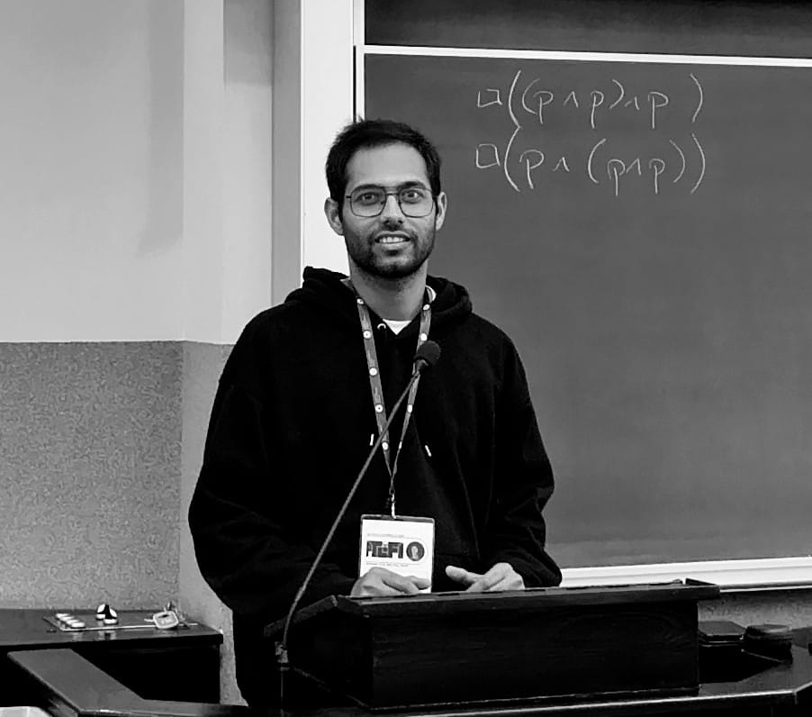

<table align="center">
<tr>
<td>

</td>
<td style="padding-left: 20px;">
<h1>Ranjan</h1>
<b>PhD Student</b> 
Department of Mathematics, IIT Indore 
Lilavati Lab • POD1E 204
</td>
</tr>
</table>

🔍 <a href="https://scholar.google.com/citations?user=0XFe5BYAAAAJ&hl=en" target="_blank">Google Scholar</a> •
🆔 <a href="https://orcid.org/0009-0006-2047-2154" target="_blank">ORCID</a> •
📘 <a href="https://www.researchgate.net/profile/Ranjan-Iiti" target="_blank">ResearchGate</a> •
📄 <a href="CV_ranjan.pdf" target="_blank">CV</a>

## About Me

I am a PhD student in the Department of Mathematics at the Indian Institute of Technology Indore. I completed my M.Sc. in Mathematics from the National Institute of Technology Durgapur and my B.Sc. (Hons.) in Mathematics from the University of Delhi. My academic journey has been supported by national fellowships and scholarships.

My research interests lie in modal logic and rough set theory, and I am currently working under the supervision of <a href="https://people.iiti.ac.in/~aquilk" target="_blank">Dr. Md Aquil Khan</a>. Alongside my research, I have served as a teaching assistant for undergraduate mathematics courses and have previous experience teaching Engineering Mathematics as an Assistant Professor.

---

## Research Interests

**Overview:** Modal Logic • Rough Set Theory • Formal Reasoning under Uncertainty

My research focuses on the interplay between Modal Logic and Rough Set Theory. I study the axiomatization of modal logics arising from rough set–based approximation systems and analyze their model-theoretic properties, including bisimulation, definability, and expressive power. My work aims to develop rigorous logical frameworks for reasoning under uncertainty and incomplete information.

---

## Publications

- <b><a href="https://doi.org/10.1080/11663081.2024.2336385" target="_blank">A Study of Modal Logic with Semantics Based on Rough Set Theory</a></b>  
  Khan, Md. A., Ranjan, & Talukdar, A. (2024). <i>Journal of Applied Non-Classical Logics</i>, 34(2–3), 223–247.

- <b><a href="https://doi.org/10.1007/978-3-031-89610-1_11" target="_blank">A Semantics of Basic Modal Language via a Rough Set Framework</a></b>  
  Khan, Md. A., & Ranjan. (2025). In <i>Logic and Its Applications (ICLA 2025)</i>, LNCS 15402, Springer.

- <b><a href="https://doi.org/10.1016/j.ins.2024.121838" target="_blank">A Semantics of the Basic Modal Language Based on a Generalized Rough Set Model</a></b>  
  Khan, Md. A., & Ranjan. (2025). <i>Information Sciences</i>, 701, 121838.

- <b><a href="https://doi.org/10.1016/j.ijar.2025.109492" target="_blank">A Formal Study of a Rough Set Model Integrating Relational and Neighbourhood System Approaches</a></b>  
  Khan, Md. A., & Ranjan. (2025). <i>International Journal of Approximate Reasoning</i>, 186, 109492.

- <b><a href="https://doi.org/10.1145/3750045" target="_blank">A Semantics for Modal Language Using a Rough Set Model Based on Subset Approximation Structure</a></b>  
  Khan, Md. A., & Ranjan. (2025). <i>ACM Transactions on Computational Logic</i>, 26(4), Article 19.
 

---

## Talks

- **Semantics of Basic Modal Language via a Rough Set Framework**  
  Indian Conference on Logic and its Applications (ICLA), ISI Kolkata, 2025  

- **Modal Logics for Approximation Frames**  
  Annual Meet of Calcutta Logic Circle, 2025  

- **A Semantics of the Basic Modal Language Based on a Generalized Rough Set Model**  
  Polish Congress of Logic, Nicolaus Copernicus University, Poland, 2025  

- **Modal Logic for Fused Relational-Neighbourhood Rough Set Models**  
  Australasian Association for Logic (Online), 2025  

---

## Workshops & Schools Attended

- Indian School on Logic and its Applications, IIT Goa, 2024  
  *(Infinite Game Theory, Automata, and Semigroups)*

- National Workshop on Mathematical Logic and Applications, Gauhati University, 2024  

- Asian Workshop on Philosophical Logic, Jadavpur University, 2025  

- Indian Conference on Logic and its Applications (ICLA), IIT Indore, 2023  

---

## Teaching

Teaching Assistant, IIT Indore  

- Numerical Methods  
- Linear Algebra  
- Differential Equations  
- Complex Analysis  

---

## Fellowships & Awards

- UGC Doctoral Fellowship  
- DST INSPIRE Scholarship  
- Qualified NET, GATE, JAM (Mathematics)

---

## Conference Visit – Poland

**Polish Congress of Logic, Nicolaus Copernicus University, Toruń, Poland (2025)**

<table>
<tr>
<td></td>
<td></td>
<td></td>
</tr>
<tr>
<td></td>
<td></td>
<td></td>
</tr>
</table>

---

## Contact

📧 ranjanphd.iiti@gmail.com

<i>Last updated: January 2026</i>

