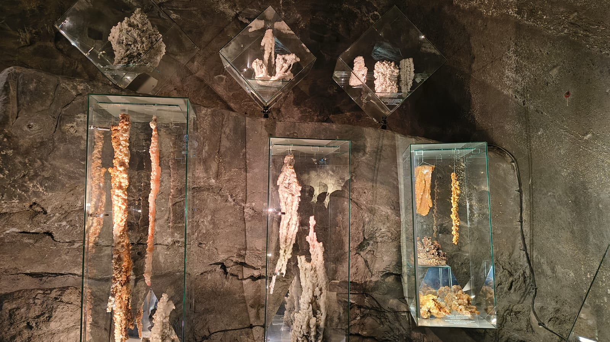
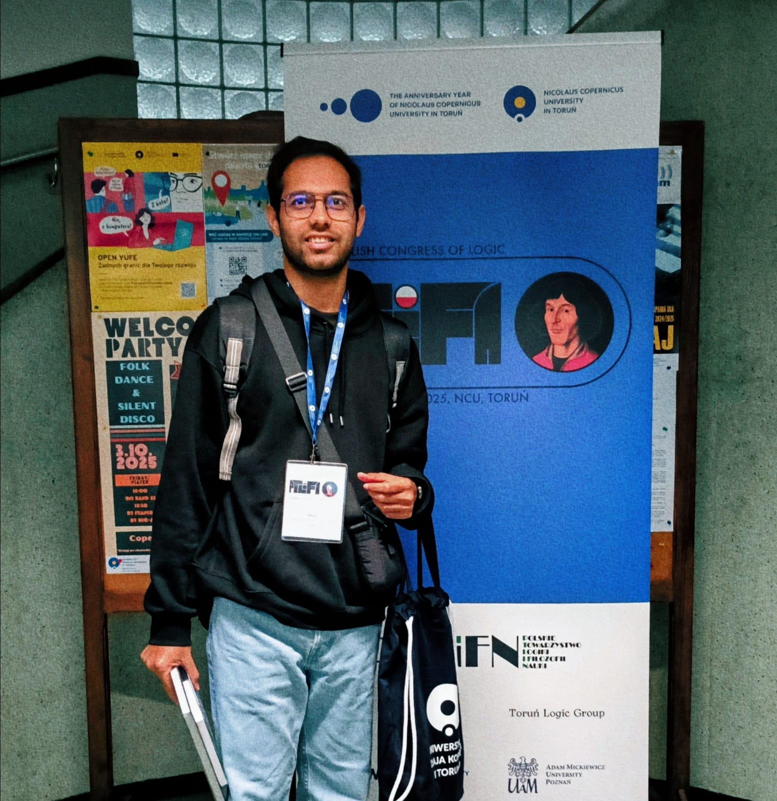
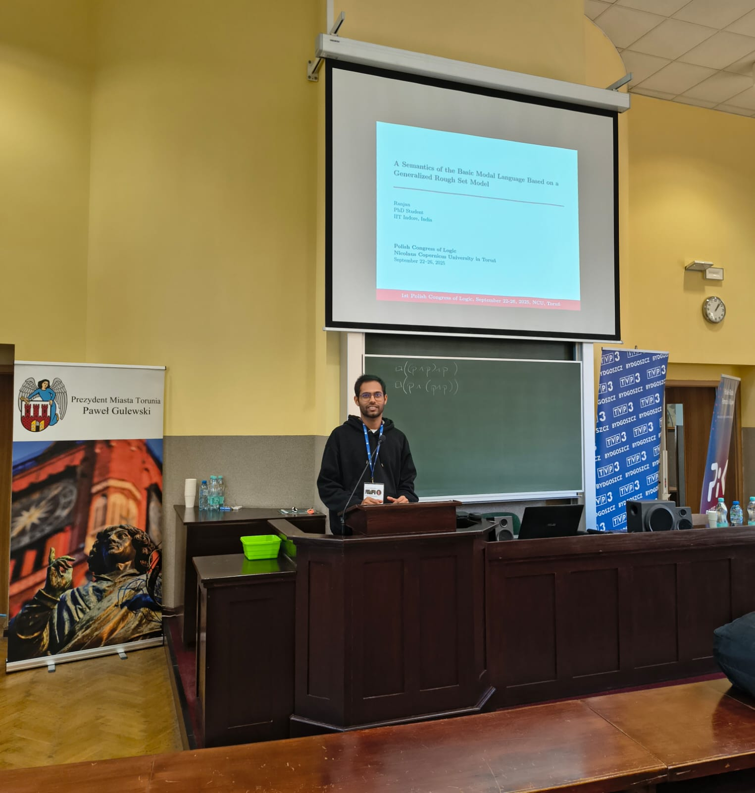
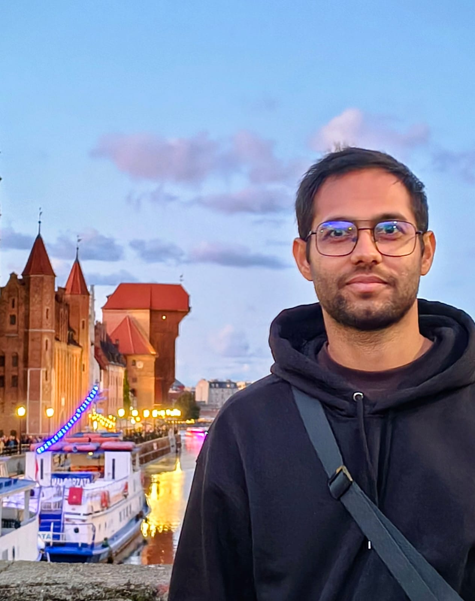

# Ranjan

**PhD Researcher**  
Lilavati Lab • POD1E 204
- Department of Mathematics
- Indian Institute of Technology Indore

---
## About Me

I am a PhD researcher in Mathematics at the Indian Institute of Technology Indore. I completed my M.Sc. in Mathematics from the National Institute of Technology Durgapur and my B.Sc. (Hons.) in Mathematics from the University of Delhi. My academic training is rooted in mathematics and logic, and I am currently working under the supervision of Dr. Md Aquil Khan.

I come from Bihar, India, and my academic journey has been supported by national fellowships and scholarships. Alongside research, I have been involved in teaching assistance for undergraduate mathematics courses and have prior experience as an Assistant Professor in engineering mathematics.  

## Research Interests

My research focuses on Modal Logic and Rough Set Theory, exploring their interplay and mathematical foundations. I specialize in the axiomatization of these systems and the study of their model-theoretic properties, including bisimulation, definability, and expressiveness. My work aims to develop rigorous logical frameworks for reasoning under uncertainty and incomplete information.

---

## Publications

- **A Study of Modal Logic with Semantics Based on Rough Set Theory**  
  *Journal of Applied Non-Classical Logics*

- **A Semantics of Basic Modal Language via a Rough Set Framework**  
  *LNCS (ICLA 2025)*

- **A Semantics of the Basic Modal Language Based on a Generalized Rough Set Model**  
  *Information Sciences*

- **A Formal Study of a Rough Set Model Integrating Relational and Neighbourhood System Approaches**  
  *International Journal of Approximate Reasoning*

- **A Semantics for Modal Language Using a Rough Set Model Based on Subset Approximation Structure**  
  *ACM Transactions on Computational Logic*

---

## Talks

- **Semantics of Basic Modal Language via a Rough Set Framework**  
  Indian Conference on Logic and its Applications (ICLA), ISI Kolkata, 2025  

- **Modal Logics for Approximation Frames**  
  Annual Meet of Calcutta Logic Circle, 2025  

- **A Semantics of the Basic Modal Language Based on a Generalized Rough Set Model**  
  Polish Congress of Logic, Nicolaus Copernicus University, Poland, 2025  

- **Modal Logic for Fused Relational-Neighbourhood Rough Set Models**  
  Australasian Association for Logic (Online), 2025  
---

## Workshops & Schools Attended

- Indian School on Logic and its Applications, IIT Goa, 2024  
  *(Infinite Game Theory, Automata, and Semigroups)*

- National Workshop on Mathematical Logic and Applications, Gauhati University, 2024  

- Asian Workshop on Philosophical Logic, Jadavpur University, 2025  

- Indian Conference on Logic and its Applications (ICLA), IIT Indore, 2023

  ---

## Conference Visit – Poland

**Polish Congress of Logic, Nicolaus Copernicus University, Toruń, Poland (2025)**

<table>
<tr>
<td></td>
<td></td>
<td></td>
</tr>
<tr>
<td></td>
<td></td>
<td></td>
</tr>
</table>

---

## Contact

📧 ranjanphd.iiti@gmail.com  
